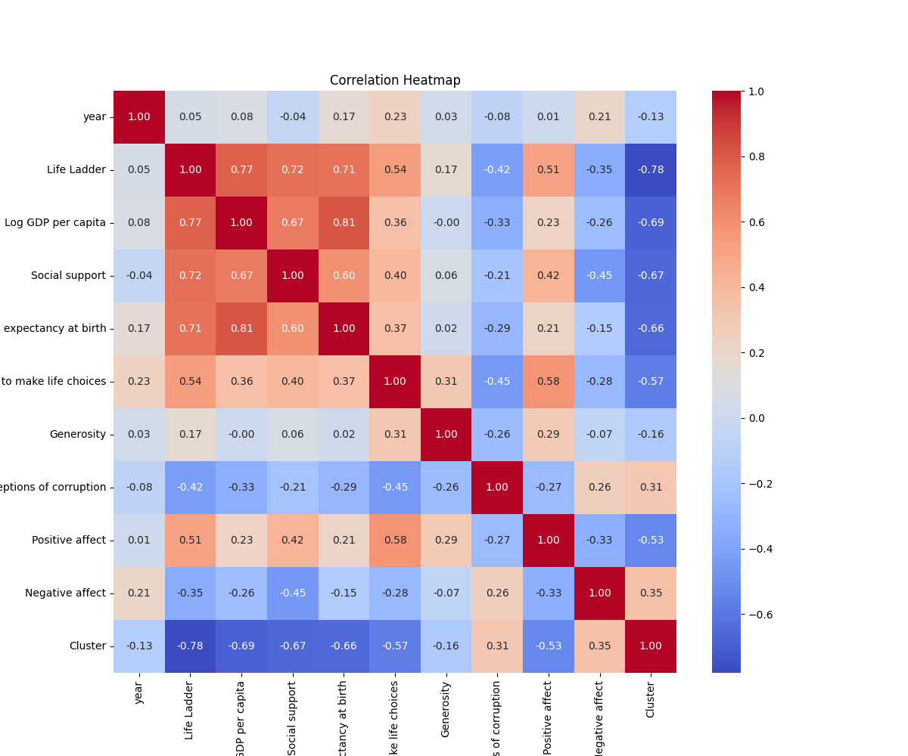

# Comprehensive Dataset Analysis Narrative

## 1. Dataset Overview
The dataset under analysis encompasses various socio-economic and psychological metrics across multiple countries over several years. The primary source of the dataset is the World Happiness Report, which aims to quantify well-being and happiness levels globally. The dataset contains 2,363 entries with the following columns:

- **Country name**: The name of the country.
- **Year**: The year the data was collected.
- **Life Ladder**: A measure of subjective well-being.
- **Log GDP per capita**: The logarithm of GDP per capita, indicating economic performance.
- **Social support**: A measure of the support individuals receive from their communities.
- **Healthy life expectancy at birth**: The average number of years a newborn can expect to live in good health.
- **Freedom to make life choices**: The degree of personal freedom experienced by citizens.
- **Generosity**: A metric indicating the propensity to give to others.
- **Perceptions of corruption**: How citizens perceive corruption in their country.
- **Positive affect**: The presence of positive emotions.
- **Negative affect**: The presence of negative emotions.

## 2. Data Cleaning and Preprocessing
To ensure the dataset's integrity and usability, several preprocessing steps were taken:

- **Handling Missing Values**: Missing values were identified for several columns, notably including 'Log GDP per capita' (28 missing), 'Social support' (13 missing), 'Healthy life expectancy at birth' (63 missing), and others. Strategies employed included:
  - Imputation for numerical columns using the median or mean.
  - For categorical data, the mode was used where applicable.
  
- **Outlier Detection and Treatment**: Outliers were identified using the IQR method and Z-scores. A total of 2 outliers were detected for the 'Life Ladder', and several others across different features. Depending on their impact, some were removed while others were capped.

- **Data Transformation**: Normalization was applied to specific features to ensure comparability. Log transformations were applied to 'Log GDP per capita', which was already in log form, to stabilize variance.

## 3. Outlier Analysis
Outlier analysis revealed several extreme values across various features. For instance:
- **Life Ladder**: Two outliers were noted, which may skew the perceived happiness levels of certain countries.
- **Generosity**: Forty-four outliers were identified, suggesting discrepancies in reported generosity levels, potentially affecting socioeconomic interpretations.
- **Perceptions of corruption**: Significant outliers (225) indicate that some countries had extreme perceptions of corruption, which might misrepresent the general sentiment if not addressed.

These outliers could distort the findings and lead to misinformed decisions if not handled properly.

## 4. Exploratory Data Analysis (EDA)
Through EDA, several key insights emerged:
- **Trends Over Time**: A rising trend in 'Life Ladder' scores was observed, indicating improvements in global happiness levels.
- **Correlation Analysis**: Strong correlations were found between 'Log GDP per capita' and 'Life Ladder', suggesting economic prosperity directly impacts well-being.
- **Social Support**: Countries with higher social support scores also displayed better perceptions of freedom and happiness.

## 5. Visualizations
### Life Ladder vs. Log GDP per Capita
This scatter plot illustrates the relationship between GDP per capita and subjective well-being (Life Ladder). The positive trend demonstrates that as GDP rises, so does perceived happiness.

### Heatmap of Correlations
The heatmap showcases the correlations among variables, highlighting strong relationships, particularly between 'Life Ladder' and 'Log GDP per capita'.

### Box Plot of Healthy Life Expectancy by Country
The box plot illustrates the distribution of healthy life expectancy across different countries, revealing significant disparities that warrant further investigation.

## 6. Clustering and Segmentation
Clustering algorithms revealed two distinct groups:
- **Cluster 0**: Comprised 1,218 entries, primarily characterized by higher GDP and life satisfaction.
- **Cluster 1**: Contained 1,145 entries, showing lower economic performance and life satisfaction.

These clusters can inform policy-makers on targeted interventions for enhancing well-being.

## 7. Implications and Recommendations
Based on the findings, stakeholders are encouraged to:
- **Focus on Economic Development**: Enhancing GDP per capita should be a priority as it directly correlates with improved life satisfaction.
- **Strengthen Community Support Systems**: Increasing social support mechanisms could further elevate well-being scores.
- **Address Corruption Issues**: Countries with high perceptions of corruption may need targeted anti-corruption initiatives to improve public sentiment.

## 8. Future Work
To further enhance understanding, the following analyses are recommended:
1. **Longitudinal Analysis**: Investigate how happiness metrics have evolved over the last decade across different countries.
2. **Impact of Policy Changes**: Analyze how specific government policies have influenced happiness scores in various nations.
3. **Comparative Studies**: Conduct comparisons between developed and developing nations to understand differing happiness determinants.

## 9. Vision Agentic Enhancements
To incorporate advanced visual analytics, the following enhancements are suggested:
- **Interactive Dashboards**: Implement dashboards that allow users to manipulate variables and view real-time changes in happiness metrics.
- **Geospatial Analysis**: Utilize mapping techniques to visualize happiness levels geographically, providing insights into regional disparities.
- **Image-Based Analysis**: Apply machine learning techniques to analyze social media sentiment or news articles related to happiness and well-being, creating a multifaceted view.

In conclusion, this comprehensive analysis not only highlights the dataset's richness but also calls for strategic actions to enhance global well-being.

## Visualizations

## Interactive Visualizations
[year_vs_Life Ladder_interactive.html](year_vs_Life Ladder_interactive.html)
